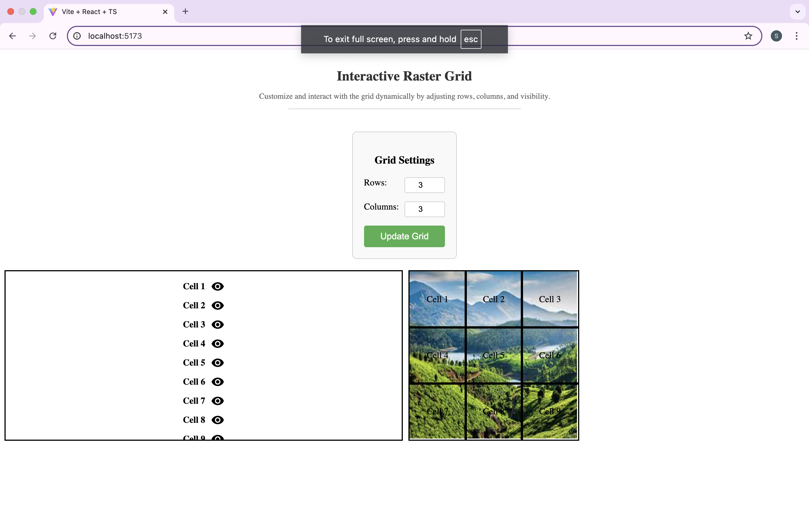

Image and Raster Interaction Web App
This web application allows users to interact with a static image overlayed with a raster grid. The grid's cells are displayed in a list view, where each cell can be toggled visible or hidden on the image. Users can also change the number of rows and columns of the raster grid.

Features
Static Image Display: Displays a predefined static image.
Dynamic Raster Grid: Grid size (rows and columns) is adjustable by the user.
Cell List View: List of grid cells with visibility control (toggle visibility using eye icons).
Hover to Highlight: Hovering over a cell name in the list highlights the corresponding cell on the image.
Click to Toggle Visibility: Clicking on a cell name toggles its visibility on the image.
Responsive Layout: The app layout is designed for desktop view.
Tech Stack
Frontend: React, TypeScript
State Management: React useState hook
Styling: Inline CSS (or can be replaced with a CSS framework)

How It Works
App Structure
The app consists of the following components:

App.tsx: Main component that manages the state of rows, columns, and cell visibility.
Grid.tsx: Displays the grid overlay on the image, updating the visibility of each cell.
CellList.tsx: Displays the list of cells with the visibility toggle controls.
GridSettings.tsx: Allows the user to adjust the number of rows and columns for the grid.
GridDetails.tsx: Displays the header or title section of the app.
Interaction
Adjust Grid Size: The user can input the number of rows and columns for the raster grid. The grid will automatically adjust.
Toggle Cell Visibility: The user can toggle visibility of each individual cell from the list view by clicking the eye icon.
Hover to Highlight: Hovering over a cell name in the list will highlight the corresponding grid cell on the image.
Usage
Once the app is running, follow these steps to interact with it:

Adjust Grid Size: Enter the desired number of rows and columns in the input fields.
Toggle Visibility: Click the eye icon next to each cell name in the list view to toggle its visibility on the image.
Hover Highlight: Hover over any cell name in the list to highlight the corresponding cell on the image.

Future Enhancements
Add responsive design for mobile/tablet support.
Add functionality to upload custom images for display.
Implement more advanced grid interaction features such as drawing, annotations, or exporting the grid.

